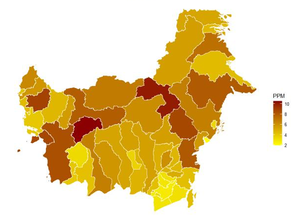
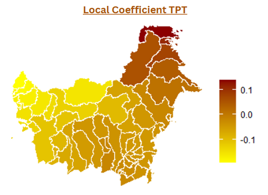
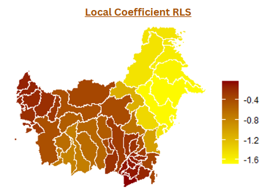
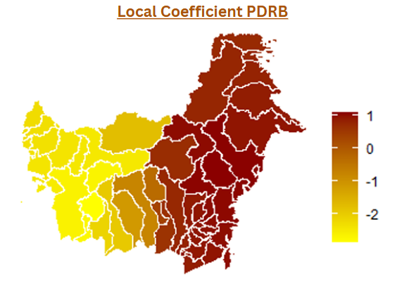

# Spatial Poverty Analysis in Kalimantan using MGWR

## Overview
Poverty remains one of the major socio-economic challenges in Kalimantan. Although overall development has improved, poverty levels still vary considerably across districts and cities, indicating spatial heterogeneity. This project applies Multiscale Geographically Weighted Regression (MGWR) to investigate how education, unemployment, and regional economic performance influence poverty differently across locations. The study is based on data from 56 districts/cities in Kalimantan (2025).

---

## Objectives
- Explore the spatial distribution of poverty across Kalimantan.
- Detect spatial autocorrelation using Moran's I.
- Compare Ordinary Least Squares (OLS) and MGWR models.
- Estimate local regression coefficients for each district.
- Identify region-specific determinants of poverty.
- Provide evidence-based policy recommendations.

---

## Dataset
### Source
- Central Bureau of Statistics Republic of Indonesia (BPS)
- Administrative boundary shapefile of Kalimantan
### Observation Unit
- 56 districts/cities
### Year
- 2025

## Variables

### Dependent Variable
- Poverty Percentage (PPM)

### Independent Variables
- Open Unemployment Rate (TPT)
- Average Years of Schooling (RLS)
- Gross Regional Domestic Product (PDRB)

---

## Methodology
The analysis follows the workflow below:


---

## Tools & Libraries
### Programming Language
RStudio
### Libraries
```r
sf
spdep
GWmodel
ggplot2
tidyverse
car
lmtest
AICcmodavg
readxl
```
---

## Key Findings
- Significant positive spatial autocorrelation was detected using Moran's I (0.1718, p = 0.0187), indicating that neighboring districts tend to exhibit similar poverty levels.
- MGWR substantially outperformed the global OLS model.
- Average Years of Schooling (RLS) consistently showed a negative relationship with poverty.
- The effects of unemployment (TPT) and regional GDP (PDRB) varied across districts.
- Local regression coefficients revealed substantial spatial heterogeneity, supporting the use of MGWR for regional poverty analysis.
  
---
## Model Performance

| Metric | OLS | MGWR |
|:--------|----:|------:|
| AICc | 233.00 | **218.46** |
| R² | 0.1495 | **0.5988** |
| RSS | 172.13 | **81.18** |

MGWR outperformed the global OLS model, achieving lower AICc and RSS values while substantially improving the coefficient of determination (R²).

---

## Outputs
- Spatial Poverty Map
  <p align="center">
  
</p>

<p align="center">
<b>Figure 1.</b> Spatial Distribution of Poverty in Kalimantan
</p>

The map illustrates the spatial distribution of poverty across districts and cities in Kalimantan. Darker colors indicate higher poverty rates, revealing substantial spatial heterogeneity that motivates the use of spatial regression methods such as MGWR.

- Moran's I Analysis
- OLS Regression Summary
- MGWR Model
- Local Coefficient Maps
  <p align="center">



</p>

<p align="center">
<b>Figure 2.</b> Local coefficients estimated by MGWR
</p>

- Significant Variable Classification
- Policy Recommendation

---


